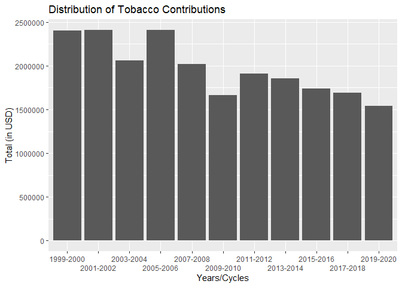
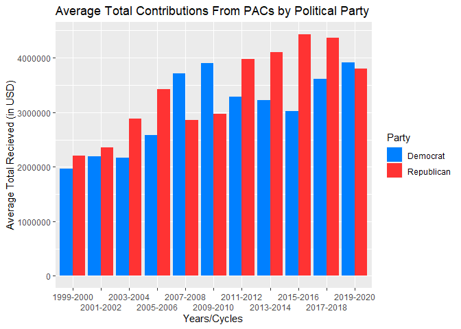

Scraping PACs
================
Kyle Miedema

## Data and Packages

``` r
knitr::opts_chunk$set(error = TRUE)
library(tidyverse)
```

    ## Warning: package 'tibble' was built under R version 4.1.1

    ## Warning: package 'readr' was built under R version 4.1.1

``` r
library(rvest)
```

    ## Warning: package 'rvest' was built under R version 4.1.2

``` r
library(styler)
```

    ## Warning: package 'styler' was built under R version 4.1.2

**Data**: For this project we were first tasked with creating a function
that was able to scrape data from the website that we were provided
with. In this instance the website was OpenSecrets, “the most
comprehensive resource for federal campaign contributions, lobbying data
and analysis anywhere”. The table I decided to scrape was the table for
the Industry Breakdown, or more specifically the industry totals. It not
only shows the total but how much Democrats and Republicans have
recieved as well. I chose this data because I was interested in doing
some analysis on the how much certain areas have changed over time.

## Scraping and Cleaning

``` r
options(scipen = 999)
scrape_pac <- function(url) {
  link <- read_html(url)
  year <- link %>%
    html_node("#communication-costs h2") %>%
    html_text() %>%
    gsub("Industry Totals, ", "", .)
  name <- link %>%
    html_nodes(".color-category a") %>%
    html_text()
  total <- link %>%
    html_nodes(".color-category+ .number") %>%
    html_text() %>%
    gsub(",", "", .) %>%
    gsub("\\$", "", .) %>%
    as.numeric()
  total_dem <- link %>%
    html_nodes(".number:nth-child(3)") %>%
    html_text() %>%
    gsub(",", "", .) %>%
    gsub("\\$", "", .) %>%
    as.numeric()
  total_rep <- link %>%
    html_nodes(".number~ .number+ .number") %>%
    html_text() %>%
    gsub(",", "", .) %>%
    gsub("\\$", "", .) %>%
    as.numeric()
  table <- tibble(
    Years = year,
    Name = name,
    Total = total,
    Total_to_Democrats = total_dem,
    Total_to_Republicans = total_rep
  )
  table
}
```

**The Code**: To begin, I created a function named scrape\_pac, that
took in a url as the input. Then using the read\_html() function, I read
in the URL and saved it to an object named link. The next few chunks of
the code are all pretty similar and are just scraping different parts of
the data. First, I wanted to scrape the title of the table in order to
get the years that corresponded with the table itself. With help from
the SelectorGadget chrome extension that we were shown in class, I got
the name of the node that I needed and put that within the html\_node()
function. Then used the html\_text() function as well. This gave me the
entire title, but I only wanted the years, so using gsub(), I removed
the words. Then saved it to an object named year to make turning it into
a tibble easier later. For the name of the sector or industry, I
followed the same process as the year described just now. For the total,
total for democrats, and total for republicans, I also followed the same
general process, but used gsub() in these instances to remove the
commas, and money signs. The reason I did this was because I wouldn’t be
able to change it to a list of numbers instead of characters If I
didn’t. I then ran as.numeric() to convert them to numbers. The last
portion of the code was simply using the scraped pieces and turning it
into a tibble. Using the tibble() function and the objects from earlier
in the function, I created the tibble in the order of year, name, total,
total for democrats, and finally total for republicans. To top it off, I
had the function return the finished tibble that was created.

**Resources**:
<https://stackoverflow.com/questions/19116442/how-to-convert-factor-to-numeric-in-r-without-nas-introduced-by-coercion-warning>

## Iterating

``` r
jump <- seq(2000, 2020, by = 2)
site <- paste("https://www.opensecrets.org/political-action-committees-pacs/industry-breakdown/", jump, sep = "")
iterated <- lapply(site, scrape_pac)
final <- do.call(rbind, iterated)
final
```

    ## # A tibble: 1,542 x 5
    ##    Years     Name                        Total Total_to_Democr~ Total_to_Republ~
    ##    <chr>     <chr>                       <dbl>            <dbl>            <dbl>
    ##  1 1999-2000 Agribusiness               1.62e7          4987207         11132691
    ##  2 1999-2000 Crop Production & Basic P~ 3.26e6          1558472          1702118
    ##  3 1999-2000 Tobacco                    2.40e6           628638          1752151
    ##  4 1999-2000 Dairy                      1.34e6           544915           790270
    ##  5 1999-2000 Poultry & Eggs             4.62e5           168335           291701
    ##  6 1999-2000 Livestock                  7.67e5           189728           576195
    ##  7 1999-2000 Agricultural Services/Pro~ 3.06e6          1099991          1960909
    ##  8 1999-2000 Food Processing & Sales    2.72e6           434278          2279989
    ##  9 1999-2000 Forestry & Forest Products 2.14e6           356408          1775137
    ## 10 1999-2000 Sugar cane & sugar beets   1.59e6           873458           717828
    ## # ... with 1,532 more rows

**The Code**: Iterating through the multiple URLs was a complicated task
but thankfully I found some extremely helpful resources (provided
below). To start I created an object named jump that used the seq()
function starting at 2000, and ending at 2020, while jumping by 2. Next,
using the paste function, I pasted the base url, not including the end
portion that changed depending the year or the cycle, instead replacing
it with the jump object I created before, and separating by empty
spaces, and named it to an object named site. Then to actually iterate,
I used the lapply() function which applies a function over a list. In
this case, I inputted site and the scrape\_pac function, meaning it’s
applying the scrape\_pac function over the site object (which is a list
of the URLs). This created multiple different tables, and I decided to
combine them into one, because it would be easier to use for analysis
that way, and it also looked nicer. To do this, I used the do.call()
function. This ran the rbind() function along the iterated tables,
combining them into one. Saving this to an object named final, then
printing the final table to observe the results.

**Resources**:
<https://stackoverflow.com/questions/40666406/loop-across-multiple-urls-in-r-with-rvest>
<https://www.rdocumentation.org/packages/base/versions/3.6.2/topics/lapply>
<https://www.rdocumentation.org/packages/base/versions/3.6.2/topics/do.call>

## Tobacco Analysis

``` r
tobacco_table <- final %>%
  select(Years, Name, Total) %>%
  filter(Name == "Tobacco")
tobacco_graph <- tobacco_table %>%
  ggplot(mapping = aes(Years, Total)) +
  geom_col() +
  labs(x = "Years/Cycles", y = "Total (in USD)", title = "Distribution of Tobacco Contributions") +
  scale_x_discrete(guide = guide_axis(n.dodge = 2))
tobacco_table
```

    ## # A tibble: 11 x 3
    ##    Years     Name      Total
    ##    <chr>     <chr>     <dbl>
    ##  1 1999-2000 Tobacco 2403539
    ##  2 2001-2002 Tobacco 2410154
    ##  3 2003-2004 Tobacco 2062084
    ##  4 2005-2006 Tobacco 2408244
    ##  5 2007-2008 Tobacco 2021675
    ##  6 2009-2010 Tobacco 1664277
    ##  7 2011-2012 Tobacco 1907759
    ##  8 2013-2014 Tobacco 1852866
    ##  9 2015-2016 Tobacco 1740150
    ## 10 2017-2018 Tobacco 1692699
    ## 11 2019-2020 Tobacco 1542814

``` r
tobacco_graph
```

<!-- -->

**The Code**: To create the table I selected only the columns I wanted
to work with using the select function. In this case, those columns were
Years, Name, and Total. To only get the rows that included tobacco, I
used the filter() function and filtered for Tobacco in the name column.
Then saved this to an object named table. In order to create the graph,
I used the table I created before and used the ggplot function. I set
the x axis to be the Years and the y axis to be the Total. Then using
geom\_col(), I created the graph. To alter the title and the labels, I
used the lab() function and changed what I needed to make the graph
better explain what I wanted. Initally the years were overlapping so to
fix that (with the help of the resource below), I had them staggered
using the scale\_x\_discrete() function and setting the guide axis to
dodge = 2.

**Analysis**: The research question I wanted to explore was “How has the
amount of tobacco contributions changed over the years?”. The reason I
wanted to explore this was because I feel like the amount of tobacco use
has been relatively decreasing, at least in terms of cigarette usage, so
I wanted to see if that was shown within the data. Initially I figured
it could go either way, with tobacco use going down, the contributions
could be going down as well, but it could also be increasing as they
need to contribute more to have legislation passed that could help
increase the usage. Looking at the table I created, you can see that
over the years, the tobacco contributions have decreased. From 1999-2000
and 2019-2020, it has gone down by about 860,000 thousand dollars. The
graph further shows this in an easier way. Using the column plot, you
can see that over the years they do generally decrease. The plot doesn’t
follow a continuous decrease like I imagined, as you can like in the
2003-2004 and the 2009-2010 cycles, they are much further down in
comparison to columns around it. This graph makes me wonder why those
two cycles are so much lower than those around it? Could it have been an
increase in anti-tobacco programs in those years? It would be
interesting to do more research and understand why that could be.

**Resources**:
<https://datavizpyr.com/how-to-dodge-overlapping-text-on-x-axis-labels-in-ggplot2/>

## Republican vs Democrat Analysis

``` r
vs_table <- final %>%
  select(Years, Name, Total_to_Democrats, Total_to_Republicans) %>%
  group_by(Years) %>%
  summarise(
    Democrat = mean(Total_to_Democrats),
    Republican = mean(Total_to_Republicans)
  ) %>%
  pivot_longer(c(Democrat, Republican), names_to = "Party", values_to = "Average")
vs_graph <- vs_table %>%
  ggplot(mapping = aes(Years, Average, fill = Party)) +
  geom_col(position = "dodge") +
  labs(x = "Years/Cycles", y = "Average Total Recieved (in USD)", title = "Average Total Contributions From PACs by Political Party") +
  scale_fill_manual(values = c("#0080FF", "#FF3333")) +
  scale_x_discrete(guide = guide_axis(n.dodge = 2))
vs_table
```

    ## # A tibble: 22 x 3
    ##    Years     Party       Average
    ##    <chr>     <chr>         <dbl>
    ##  1 1999-2000 Democrat   1960785.
    ##  2 1999-2000 Republican 2200238.
    ##  3 2001-2002 Democrat   2192553 
    ##  4 2001-2002 Republican 2351369.
    ##  5 2003-2004 Democrat   2167519.
    ##  6 2003-2004 Republican 2885946.
    ##  7 2005-2006 Democrat   2587326.
    ##  8 2005-2006 Republican 3420170.
    ##  9 2007-2008 Democrat   3716599.
    ## 10 2007-2008 Republican 2860894.
    ## # ... with 12 more rows

``` r
vs_graph
```

<!-- -->

**The Code**: To create the table, I used the select() function and
selected the columns I wanted to work with, which were Years, Name,
Total\_to\_Democrats, and Total\_to\_Republicans. Then I grouped them by
their years using the group\_by() function, because I wanted the average
by their years. Using the summarise() function (with the help of the
group\_by() function), I created two different columns, one for
democrats and one for republicans, and taking the mean for each year for
each column created. I would’ve been done there, but in order to make
the data even easier to use for the graph, I decided to use
pivot\_longer() and create a column for the political party and have
their averages in their own column. To create the graph, I used the
table data I had just created with the ggplot() function. I set the
aesthetics to have the x as the Years, the y as the Average, and then
fill based on the party it belonged too. I figured a column plot would
be the best to show the difference of the distributions over time and
compare them. So I used the geom\_col() function. Inside the function I
used the position=“dodge” argument to put the graphs side by side. I
changed the names of the axis and added a descriptive title using the
labs() function as well. To change the colors of the graph to correspond
to their political party color, I used the scale\_fill\_manual()
function and got the values for their colors to change them. And just
like the tobacco graph, I needed to jitter the dates so that they would
not overlap, using the scale\_x\_discrete() function and the guide
argument of n.dodge=2.

**Analysis**: The research question for this portion that I wanted to
explore was “What is the average total contributions that each party
receives each year, and who receives more or less?”. I wanted to explore
this because I thought it would be interesting to see just which party
would receive the most contributions from PACs, and what that
distribution would look like. Originally, I kind of assumed they would
be relatively similar overall, but that republicans would generally take
more overall. Looking at the table, you can see that for most years,
republicans do indeed receive more average money from PACs. For most
years it seems relatively close though, but in 2015-2016 there is about
a 14 million dollar difference. That is something that may be worth
further exploration, what makes the difference in this cycle so much
different? To better see this difference visually I created a graph. The
graph makes it easier to see the difference between the two parties and
the money they recieve over the course of the 11 cycles. The graph
further shows that overall, most years, republicans recieve more money
from PACs. The graph also helps to show the large difference between the
parties in the 2015-2016 cycle. Another interesting thing to point out
is that the average has grown pretty considerably over the course of
time, of course it seems to fluctuate, but the difference between the
averages from the 1999-2000 cycle to the 2019-2000 cycle is pretty
large.

**References**:
<https://www.datanovia.com/en/blog/ggplot-legend-title-position-and-labels/#change-the-legend-font-size-color-and-face>
<https://www.rapidtables.com/web/color/RGB_Color.html>
<https://stackoverflow.com/questions/16528167/how-to-combine-different-barplot-in-r>
